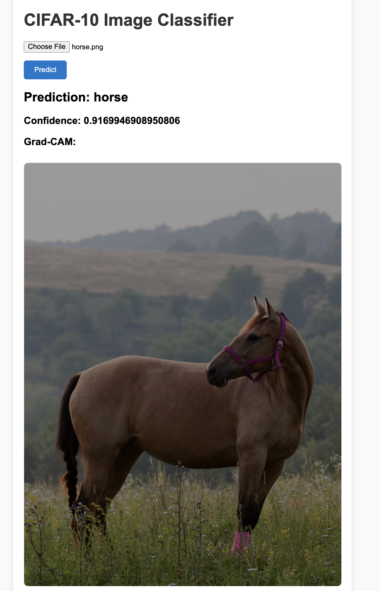

# CIFAR-10 FastAPI Web App with Grad-CAM

  
*Web interface showing CIFAR-10 predictions and Grad-CAM visualization.*

This project is a **full-stack AI demo** combining **FastAPI**, **TensorFlow**, and **CIFAR-10 image classification**. It demonstrates building a responsive web app for image prediction with **explainable AI features**.

---

## 🔹 Features

- Upload an image → Predict its class among **CIFAR-10 categories**:
- - View **Grad-CAM heatmap** overlayed on the image to explain model predictions.  
- Optional **LLaMA chatbot integration** for text-based questions.  
- Async FastAPI + worker process for **responsive web inference**.  

---

## 🔹 Project Structure
cifar10-fastapi-app/
│
├─ app/
│ ├─ main.py # FastAPI server
│ ├─ utils.py # helpers: preprocess, Grad-CAM, load model
│ ├─ static/ # Grad-CAM images, CSS, JS
│ └─ templates/ # index.html
│
├─ models/
│ └─ cifar10_cnn_model.keras # trained model
│
├─ predictor_worker.py # worker script for predictions
├─ requirements.txt # Python dependencies
├─ README.md # project explanation
└─ .gitignore

---

## 🔹 Installation

Clone the repo and install dependencies:

```bash
git clone https://github.com/yourusername/cifar10-fastapi-app.git
cd cifar10-fastapi-app
pip install -r requirements.txt

🔹 Usage

Start the FastAPI server:

uvicorn app.main:app --reload
Open in your browser:

http://127.0.0.1:8000

Upload an image to see:

Predicted class

Confidence score

Grad-CAM heatmap overlay

The worker script (predictor_worker.py) handles heavy TensorFlow inference asynchronously if needed.


